# Reproducible Scientific Notebooks through YAML

This is a lightweight framework for enforcing reproducibility and organization in data-driven academic research by leveraging structured YAML configuration files.

In computational research, especially when using notebooks (e.g., Jupyter), it is essential to ensure that all relevant data and metadata are systematically saved for reproducibility and future analysis. However, a structured approach to managing these configurations is often lacking. Here, we introduce a simple YAML-based experimental parameter management system that can easily trace experimental records, figures and data files.

**Please note** that this is NOT about package management. Reproducible computing environment is a separate topic and should be handled with tools like `conda`, `Pkg` or `uv`.

## Overview 

```mermaid
flowchart TD
    A[Create YAML Config_'version' File] --> B[Load Config in Notebook / Scripts]
    B --> C[Run Experiment / Simulation]
    C --> D[Save Results &#40;Data, Figures&#41; with 'version' Prefix]
    D --> E[Reproduce / Cross-validate Results using 'version' Config]
```



## Features / Why use this?

- **Hot-swappability**: Tired of creating new notebooks for every experiment? Easily swap configurations to run different parameter sets without code changes
- **Automatic Traceability**: Automatically generate unique experiment IDs and consistent file naming conventions
- **Parameter Validation**: Ensure all required parameters are present before experiment execution
- **Human-Readable Configs**: YAML format is easy to read, write, and maintain compared to code-based configuration
- **Language Agnostic**: Works with any programming language that supports YAML parsing (e.g., Python, Julia, R, MATLAB)

## Why YAML?

YAML strikes the perfect balance between human readability and machine parsing. There is minimal learning curve needed for researchers to adopt YAML for configuration management. It is widely supported across programming languages, making it an ideal choice for cross-language projects.

example YAML configuration:
```yaml
# config_v1.yml
notebook:
  version: "v1" # Unique ID for this experiment, idiomatically this should be identical to the config_{suffix}
  name: "my-simulation" # Notebook data folder
  desc: "Simulate and capture the results of ODE models in SBML format"

exp:
  model: "lotka-volterra.xml"
  simulation:
    start: 0
    stop: 1000
    step: 100        
```

## Getting Started

1. **Install Dependencies**: Ensure you have a YAML parser for your programming language (e.g., PyYAML for Python, YAML.jl for Julia)
2. **Create a Configuration File**: Define your experiment parameters in a `.yaml` file
3. **Create a .env File**: Define the `DATA_PATH` variable in a `.env` file to specify where your project data (configurations, results, figures) will be stored. You can use the provided `.env.example` as a template.
3. **Load and Validate Config**: Use the provided utilities to load and validate your configuration by following the example usage below

## Example Usage

### Compare the simulation of the Lotka-Volterra model in both Python and Julia using the same configuration file

- **Python Example**: See the `python-example` folder for a complete example using Python with `libroadrunner` and `antimony`
- **Julia Example**: See the `julia-example` folder for a complete example using Julia with `DifferentialEquations.jl` and `SBML.jl`

### Example Code Snippet (Julia)

Initialize configuration

```julia
using YAML
# import Functions from configmanager 
include("ConfigManager.jl")
# This will create the folder structure under {DATA_PATH}/my-simulation if it doesn't already exist
ConfigManager.initialise_config("my-simulation", verbose=1)
```

Loading and printing configuration

```julia
# Load the configuration (specify folder name and optional suffix)
# default suffix is "v1"
config = ConfigManager.load_configs("my-simulation", "v1")
ConfigManager.print_config(config)
```

Saving Data
```julia
# This will automatically save the data as {DATA_PATH}/my-simulation/data/v1_simulation_results_julia.csv
ConfigManager.save_data(notebook_config, df, "simulation_results", data_format="csv", verbose=1)
```

### Example Code Snippet (Python)

Initialize configuration

```python
from config_manager import initialise_config

initialise_config(folder_name="my-simulation", verbose=1)
```

Loading and printing configuration

```python 
from config_manager import load_configs, print_config

# Load the configuration (specify folder name and optional suffix)
loaded_config = load_configs(folder_name="my-simulation", config_suffix="v1") # default suffix is "v1"
print_config(loaded_config)
```

Saving Data

```python
from config_manager import save_data
import pandas as pd
result_df = pd.DataFrame(result, columns=rr.timeCourseSelections)
save_data(
    notebook_config=loaded_config["notebook"],
    data=result_df,
    data_name="simulation_results_python",
    data_format="csv",
)
```

### Using Another Config File 

To use a different configuration file, simply change the `config_suffix` parameter when loading the configuration. For example, to use `config_v2.yml`, you would do:

```python
loaded_config = load_configs(folder_name="my-simulation", config_suffix="v2")
```

```julia
config = ConfigManager.load_configs("my-simulation", "v2")
```

### Folder Structure

```
reproducible-scientific-notebook-configurations/
├── .env
├── juliaexample/
│   ├── Manifest.toml
│   ├── Project.toml
│   └── src/
│       ├── ConfigManager.jl
│       ├── lotka-volterra.xml
│       └── my-notebook.ipynb
├── project-data/
│   └── my-simulation/
│       ├── config_v1.yml 
│       ├── data/
│       │   ├── v1_simulation_results_julia.csv
│       │   └── v1_simulation_results_python.csv
│       └── figures/
│           ├── v1_simulation_plot_julia.png
│           └── v1_simulation_plot_python.png
└── python-example/
    └── notebooks/
        ├── config_manager.py
        ├── lotka-volterra.xml
        ├── my-notebook.ipynb
```

## Contributing

Contributions are welcome! Please fork the repository and submit a pull request with your changes. For major changes, please open an issue first to discuss what you would like to change.

## License

This project is licensed under the MIT License.

## Citation

If you found this project useful, a simple mention e.g. "reproducible-scientific-notebook-template (github.com/AnEvilBurrito/reproducible-scientific-notebook-template)" would be greatly appreciated. 
