# Reproducible Scientific Notebooks through YAML

This is a lightweight framework for enforcing reproducibility and organization in data-driven academic research by leveraging structured YAML configuration files.

In computational research, especially when using notebooks (e.g., Jupyter), it is essential to ensure that all relevant data and metadata are systematically saved for reproducibility and future analysis. However, a structured approach to managing these configurations is often lacking. Here, we introduce a simple YAML-based experimental parameter management system that can easily trace experimental records, figures and data files.

**Please note** that this is NOT about package management. Reproducible computing environment is a separate topic and should be handled with tools like `conda`, `Pkg` or `uv`.

## Overview 

```mermaid
flowchart TD
    A[Create YAML Config File] --> B[Load Config in Notebook / Scripts]
    B --> C[Run Experiment / Simulation]
    C --> D[Save Results &#40;Data, Figures&#41; with Metadata]
    D --> E[Reproduce / Cross-validate Results]
```



## Features / Why use this?

- **Hot-swappability**: Tired of creating new notebooks for every experiment? Easily swap configurations to run different parameter sets without code changes
- **Automatic Traceability**: Automatically generate unique experiment IDs and consistent file naming conventions
- **Parameter Validation**: Ensure all required parameters are present before experiment execution
- **Human-Readable Configs**: YAML format is easy to read, write, and maintain compared to code-based configuration
- **Language Agnostic**: Works with any programming language that supports YAML parsing (e.g., Python, Julia, R, MATLAB)

## Why YAML?

YAML strikes the perfect balance between human readability and machine parsing. There is minimal learning curve needed for researchers to adopt YAML for configuration management. It is widely supported across programming languages, making it an ideal choice for cross-language projects.

example YAML configuration:
```yaml
# config.yml
notebook:
  id: "my-notebook" # Unique ID for this experiment
  name: "Model simulation"
  desc: "Simulate and capture the results of ODE models in SBML format"

exp:
  model: "lotka-volterra.xml"
  simulation:
    start: 0
    stop: 1000
    step: 100      
```

## Getting Started

1. **Install Dependencies**: Ensure you have a YAML parser for your programming language (e.g., PyYAML for Python, YAML.jl for Julia)
2. **Create a Configuration File**: Define your experiment parameters in a `.yaml` file
3. **Create a .env File**: Define the `DATA_PATH` variable in a `.env` file to specify where your project data (configurations, results, figures) will be stored. You can use the provided `.env.example` as a template.
3. **Load and Validate Config**: Use the provided utilities to load and validate your configuration, alternatively, you can implement your own configuration management 

## Example Usage

### Compare the simulation of the Lotka-Volterra model in both Python and Julia using the same configuration file

- **Python Example**: See the `python-example` folder for a complete example using Python with `libroadrunner` and `antimony`
- **Julia Example**: See the `julia-example` folder for a complete example using Julia with `DifferentialEquations.jl` and `SBML.jl`

## Folder Structure

## Contributing

Contributions are welcome! Please fork the repository and submit a pull request with your changes. For major changes, please open an issue first to discuss what you would like to change.

## License

This project is licensed under the MIT License. 
    